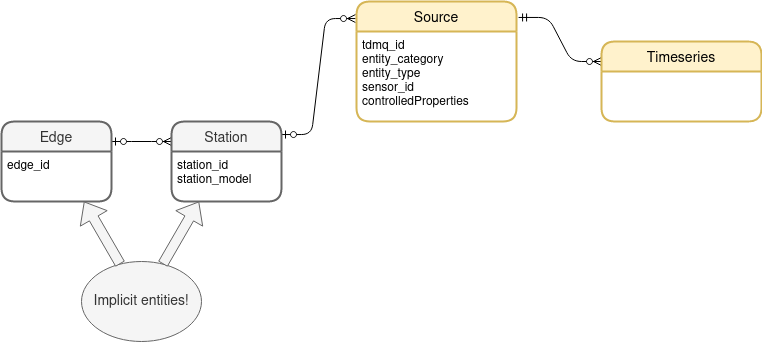

# Understanding scalar sensor data in the TDM polystore


## High-level model

The TDM polystore has a very simple data model with two main entities:  Sources
and Timeseries.

A Source is some data-producing sensor.  It produces data records, which are
ingested by the platform and made available as Timeseries -- which represent
a specific query on the available data.  Examples of Sources are the Current
Transformers (CTs) attached to a [IotaWatt energy
monitor](https://iotawatt.com/), or the photosensitive pulse counter on an
[EmonTX](https://guide.openenergymonitor.org/technical/emontx/).

Sources are normally attached to a Station (e.g., a IotaWatt device), and
Stations can be attached to an [Edge
device](https://tdm-project.github.io/tdm-edge/); this is not mandatory, but it
is the standard configuration for TDM sensors.  The Station and Edge entities
are not explicitly represented in the query interface:  instead, the relevant
attributes are returned directly as part of the Source.





## The Source

### Identifying a Source

Every source is identified by a unique `tdmq_id`.  This ID can be used to
retrieve a specific, pre-identified Source with the Client.

### Where is it connected?

As mentioned previously, a Source may be connected to a Station, which in turn
may be connected to an Edge.  If this is the case, these attributes will be
populated:
* `edge_id`
* `station_id`
* `station_model`

The `station_model` will identify the type of station (e.g., `emonTx`, or
`IoTaWatt`). On the other hand, the `edge_id` and `station_id` will identify the
specific Edge and Station, respectively.   More details and examples will be
provided in the coming sections.


### What type of device is it?

The type of Source and the time series it generates is described by the
combination of several properties.  These will serve you both to understand what
Source was returned by a query and also to query the platform for the specific
sensors that you require.

1. The type of Source classified by its `entity_category` and `entity_type`.
2. The specific Source, which many be one many attached to the same station
   device, is identified by a `sensor_id`.
3. **Based on its specific entity type**, the Source will have specific list of
   *controlledProperties* listing its capabilities.

Note that a Source may not transmit data for all its theoretical capabilities.

#### Entity categories and entity types

Every source represents an entity with a specific category and type; this model
is inspired by the FIWARE data model.  Within each category, each entity type is
unique.  On the other hand, the same type *name* may appear in two different
categories, though the two entity types would not be related in any way.

These are the currently known entity categories and types.

| Category   | Type                     |
| ---        | ---                      |
| Radar      | MeteoRadarMosaic         |
| Satellite  |                          |
| Simulation |                          |
| Station    | WeatherObserver          |
| Station    | PointWeatherObserver     |
| Station    | TemperatureMosaic        |
| Station    | EnergyConsumptionMonitor |
| Station    | TrafficObserver          |
| Station    | DeviceStatusMonitor      |

:bulb: Throughout this document we use the syntax
`entity_category`**::**`entity_type`; e.g., *Station::EnergyConsumptionMonitor*.


#### Example

As an example, let's briefly consider the EmonTX energy monitor.

The EmonTX can manage:
* four CTs;
* a Voltage measurement line;
* a Pulse counter;
* six temperature probes.

That's a total of 12 Sources from a single Station device.

The first CT sensor, called `L1`, will look something like this:

| Attribute              | Value                      |
| -----------------      | -------------------------- |
| `edge_id`              | `edge-12d45e`              |
| `station_id`           | `emonTx`                   |
| `station_model`        | `emonTx`                   |
| `sensor_id`            | `L1`                       |
| `entity_category`      | `Station`                  |
| `entity_type`          | `EnergyConsumptionMonitor` |
| `controlledProperties` | list of names -- see below |

Again, the list of `controlledProperties` is determined by the **capabilities**
of the specific `entity_type`.  The `EnergyConsumptionMonitor` has these
controlled properties:

| property        | unit   |
| --------------- | ------ |
| voltage         | V      |
| current         | A      |
| apparentPower   | W      |
| realPower       | W      |
| powerFactor     |        |
| consumedEnergy  | Wh     |
| meterPulses     |        |
| frequency       | Hz     |

The list of properties for the various entity types is provided further down in
this document.

:warning: **Important**:  while the controlledProperties properties is a list of
*capabilities*, these may not all be active in the specific Source.  For
instance, the EmonTX's voltage monitor line is classified as an
`EnergyConsumptionMonitor`, but it will only provide values for the `voltage`
property.  Likewise, the Pulse counter will only feed data to the `meterPulses`
property, though as an entity of type `EnergyConsumptionMonitor` it will have
the full set of controlled properties.

Sources will routinely have some controlled properties that provide no values
and will only return time series of `None`.


## Key source metadata

This metadata will allow you to determine what type of sensor the source is and
also determine what sources are part of the same device or attached to the same
edge.

### Field name: `edge_id` 

ID associated with the specific edge device.  Normally computed from hardware
properties.  Example: `edge-12d45e`


### Field name: `station_model`

The type of station to which the source is connected.  Known models, at this time:

| Station type                          | `station_model`  |
| ------------                          | ---------------- |
| EmonTx open meter                     | `emonTx`         |
| IoTaWatt                              | `IoTaWatt`       |
| Atmospheric sensing station           | `airRohr`        |
| Edge gateway data or on-board sensors | `edge`           |


### Field name: `station_id`

A station is a single device -- such as in an EmontTX, a IotaWatt, etc.

The `station_id` is a specific identifier for the station.  The `station_id` is
unique within the context of the edge to which it's connected.

| Station type | `station_model`  | `station_id`              |                                                                                                                                              |
| ------------ | ---------------- | ------------              | ------------------------------------------------------                                                                                       |
| EmonTx       | `emonTx`         | `emonTx`                  | All EmonTx stations are registered with the same id                                                                                          |
| IoTaWatt     | `IoTaWatt`       | `IOTAWATT` or custom      | `IOTAWATT` is the default station ID, but it be customized by the user through the IoTaWatt configuration, so other names are also possible. |
| Atm. station | `airRohr`        | like `esp8266-xxxxxxx`    | Each device has a hardware-based unique station ID that looks like `esp8266-xxxxxxx`.                                                        |
| Edge gateway | `edge`           | like `Edge-WWXXYYZZ.EDGE` | Unique hardware-based `station_id`. `edge_id`                                                                                                |

### Field name: `sensor_id`

ID of the specific sensor or line being measured.  These depend on the specific
characteristics of the Station.  In the following sections we go through the
various known station models.

#### IotaWatt

Each `sensor_id` is a specific line name that has been configured on the
IoTaWatt; e.g., `sensor_id = "FRIDGE"`.

Entity types:
* Normal CTs: `Station::EnergyConsumptionMonitor`.
* Reference voltage sensor: `Station::EnergyConsumptionMonitor`.

Note that the reference voltage sensor will only transmit values for the
`voltage` property.  The other CTs will transmit the measurements according to
the specific IoTaWatt configuration (a IoTaWatt can be configured to transmit
only some of the measurements it is capable of acquiring from the CT).


#### EmonTX

The EmonTX has a fixed set of `sensor_id`s.  Here is the list:

| `sensor_id` | `entity_type`                     |
| ----------- | -------------                     |
| `L1`        | Station::EnergyConsumptionMonitor |
| `L2`        | Station::EnergyConsumptionMonitor |
| `L3`        | Station::EnergyConsumptionMonitor |
| `L4`        | Station::EnergyConsumptionMonitor |
| `V`         | Station::EnergyConsumptionMonitor |
| `PULSE`     | Station::EnergyConsumptionMonitor |
| `DS1820-1`  | Station::WeatherObserver          |
| `DS1820-2`  | Station::WeatherObserver          |
| `DS1820-3`  | Station::WeatherObserver          |
| `DS1820-4`  | Station::WeatherObserver          |
| `DS1820-5`  | Station::WeatherObserver          |
| `DS1820-6`  | Station::WeatherObserver          |

:bulb: Remember that the various sensors from the same station will be mapped
to different sources.

#### Indoor atmospheric sensor ids

The indoor atmospheric sensor units used in the TDM project are of two types,
resulting in two known sensor ids:

| `sensor_id` | `entity_type`            |
| ----------- | -------------            |
| `BME280`    | Station::WeatherObserver |
| `HTU21D`    | Station::WeatherObserver |


#### Outdoor atmospheric sensor ids

| `sensor_id` | `entity_type`            |
| ----------- | -------------            |
| `BME280`    | Station::WeatherObserver |
| `HTU21D`    | Station::WeatherObserver |
| `DAVIS`     | Station::WeatherObserver |
| `ARGENT`    | Station::WeatherObserver |

:warning: Rain gauges:  we don't have the ids of these sensors at this time.


## Controlled properties for the various entity types


### entity type: Station::EnergyConsumptionMonitor

| property        | unit   |
| --------------- | ------ |
| voltage         | V      |
| current         | A      |
| apparentPower   | W      |
| realPower       | W      |
| powerFactor     |        |
| consumedEnergy  | Wh     |
| meterPulses     |        |
| frequency       | Hz     |

### entity type: Station::WeatherObserver

| property             | unit    |
| -------------------- | ------  |
| altitude             | m       |
| relativeHumidity     | %       |
| temperature          | °C      |
| barometricPressure   | Pa      |
| illuminance          | Lux     |
| infraredLight        |         |
| windDirection        | degrees |
| windSpeed            | m/s     |
| precipitation        | mm      |
| CO                   |         |
| NO                   |         |
| NO2                  |         |
| NOx                  |         |
| SO2                  |         |
| PM10                 | ppm     |
| PM2.5                | ppm     |


### entity type: Station::DeviceStatusMonitor

| property             | unit                   |
| -------------------- | ------                 |
| temperature          | °C                     |
| illuminance          | Lux                    |
| lastBoot             | timestamp ISO-8601 UTC |
| operatingSystem      | string                 |
| kernelRelease        | string                 |
| kernelVersion        | string                 |
| systemArchitecture   | string                 |
| cpuCount             | integer                |
| diskTotal            | MB                     |
| diskFree             | MB                     |
| memoryTotal          | MB                     |
| memoryFree           | MB                     |
| swapTotal            | MB                     |
| swapFree             | MB                     |


## Interpreting ingested IoTaWatt data

`"station_model" = "IoTaWatt"`

Each line name configured on the IotaWatt will be registered as an independent
`Source` of the same `Station`.  All sources from the same IoTaWatt will have
the same `station_id` and `edge_id`, locating them as sensors attached to the
same monitoring device.

### Measurement name format

General naming format: `NAME_UNIT`.

Example: `FRIDGE_W`,`FRIDGE_A`,`FRIDGE_Wh`, etc.

### Valid unit symbols and corresponding `controlledProperties`

| Unit symbol | controlled property | Meaning |
| ----------- | ------------------- | ------- |
| A           | current             |         |
| AC          | apparentPower       |         |
| PF          | powerFactor         |         |
| W           | realPower           |         |
| Wh          | consumedEnergy      |         |
| F           | frequency           |         |
| V           | voltage             |         |


### Valid signal names

TBD

We need to fix: 
* the list of recognized loads/lines, including home generation system (e.g., solar panels)
* the name for the voltage reference line.

Measurements with signal names not in this list will not be save in the
tdm-polystore.


### Configuring the device

Full instructions:  https://tdm-project.github.io/tdm-edge/it/iotawatt-station-config.it.html

Very important:  for correct recording of the data from the iotawatt you must
set:

    measurement = iotawatt
    field-key = $name

#### Effect of `measurement` and `field-key`

Desired setting:

    measurement = iotawatt
    field-key = $name

IotaWatt will send messages with all line values.  The will be saved together
and result in more efficient operation.  For example, a single message will
contain:

```
Timestamp
FRIDGE_W
FRIDGE_A
FRIDGE_Wh
etc.
```

Default setting:

    measurement =
    field-key =

Iotawatt will send single messages for each line measurement. So, for example,
we'll have messages like:

```
Timestamp
FRIDGE_W
```

```
Timestamp
FRIDGE_A
```
```
Timestamp
FRIDGE_Wh
```
etc.

## Interpreting ingested EmonTx data

`"station_model" = "emonTx"`

Each line managed by the emonTx will be registered as an independent `Source` of
the same Station.  All sources from the same EmonTx will have the same
`station_id` and `edge_id`, locating them as sensors attached to the same
monitoring device.


### EmonTx Sources

For every EmonTx that is sending data to the platform, all its lines will exist
as Sources.  Here is the full list of the sensors on the EmonTx:

| `sensor_id` | `entity_type`                     |
| ----------- | -------------                     |
| `L1`        | Station::EnergyConsumptionMonitor |
| `L2`        | Station::EnergyConsumptionMonitor |
| `L3`        | Station::EnergyConsumptionMonitor |
| `L4`        | Station::EnergyConsumptionMonitor |
| `V`         | Station::EnergyConsumptionMonitor |
| `PULSE`     | Station::EnergyConsumptionMonitor |
| `DS1820-1`  | Station::WeatherObserver          |
| `DS1820-2`  | Station::WeatherObserver          |
| `DS1820-3`  | Station::WeatherObserver          |
| `DS1820-4`  | Station::WeatherObserver          |
| `DS1820-5`  | Station::WeatherObserver          |
| `DS1820-6`  | Station::WeatherObserver          |

:warning: Note that these sources will be registered even if they are not
sending real data (e.g., because there is no temperature sensor attached or
because there is not CT attached to the specific port).

Moreover, remember that the set of associated controlled properties are defined
by the entity type.  However, not all properties are supported by all the listed
sensors.

For instance, the `PULSE` sensor will have the full set of
`EnergyConsumptionMonitor` controlled properties but will have data only for the
`meterPulses` property.
